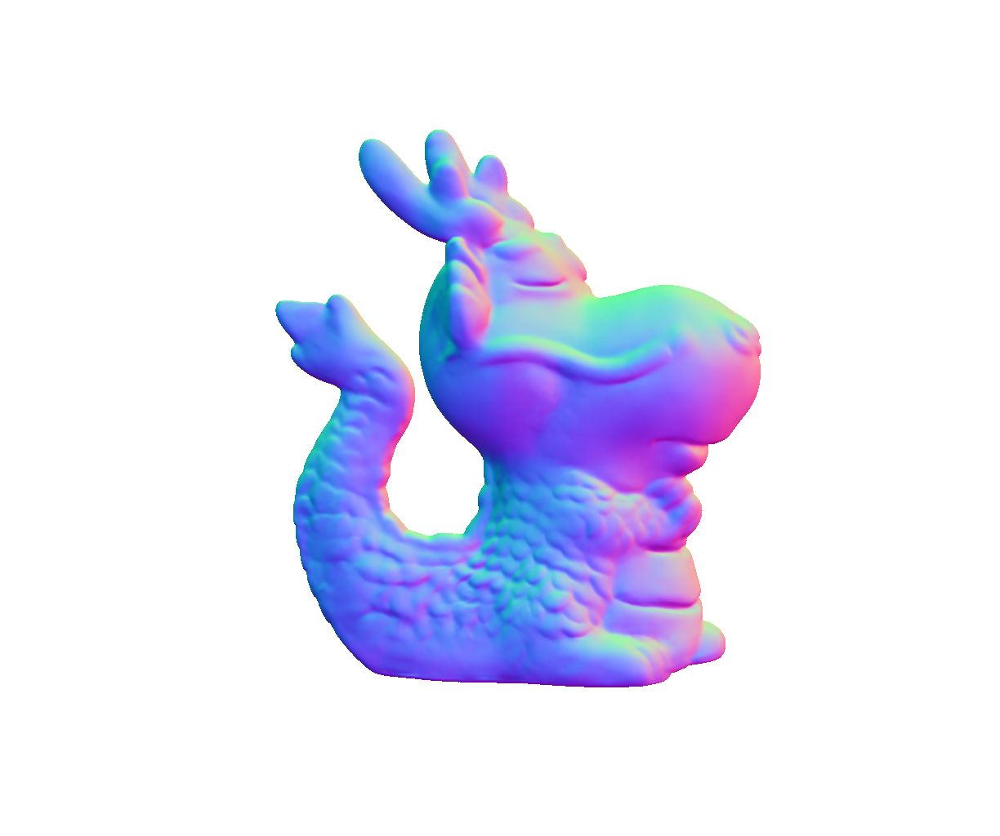
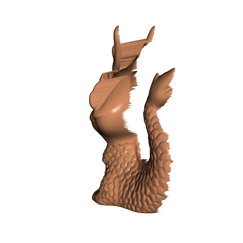
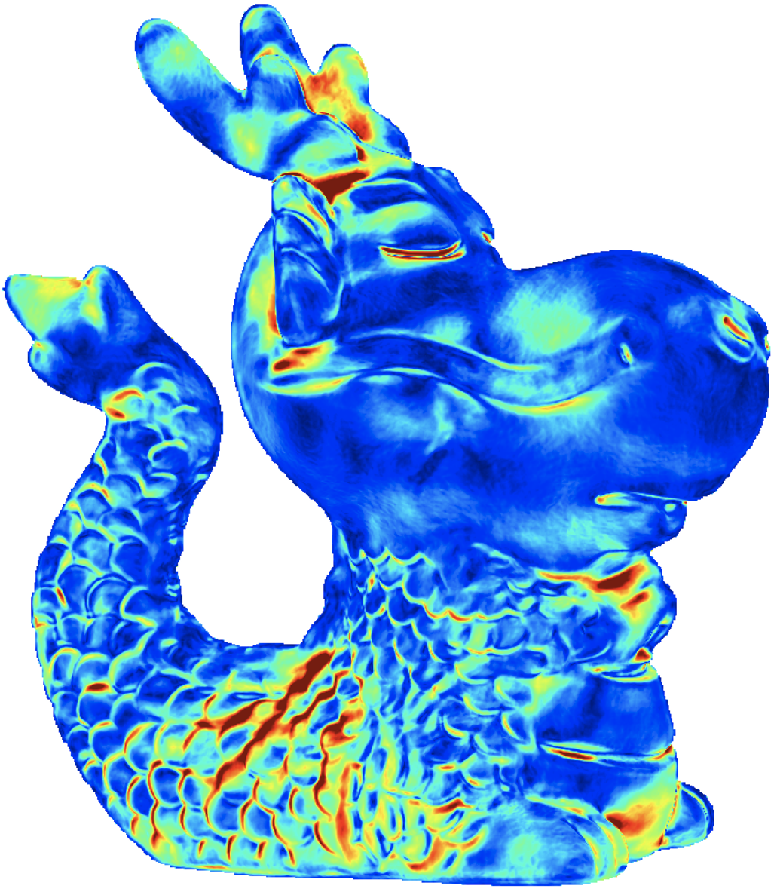
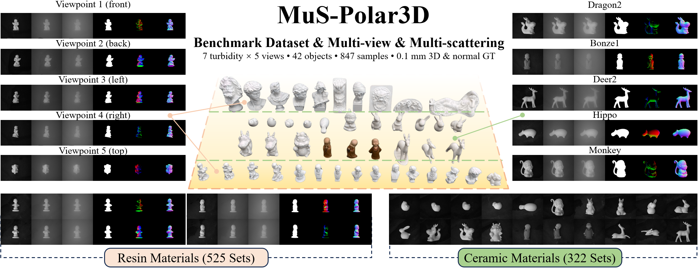
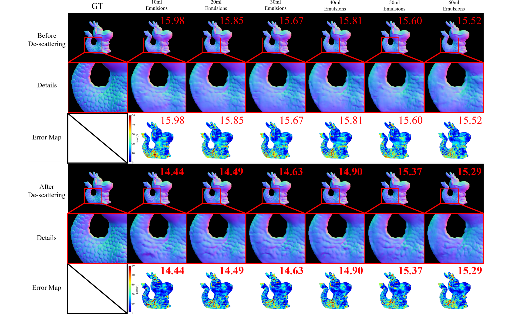

# PolarObject
[]() 
[]()


A deep learning–based project for **scattered image normal estimation**.
This repository integrates multiple network architectures (DeepSfP, AttentionU<sup>2</sup>Net, SfPW, etc.) to process and analyze scattered images.

<p align="center">
  
  
  
</p>

## ✨ Features

* **Normal Estimation**: Accurate normal prediction within the \[-1, 1] range.
* **Multiple Models**: Includes implementations of DeepSfP, AttentionU<sup>2</sup>Net, SfPW, and more.
* **Training Logs**: Automatically generates `training_log_xxx.csv` files to record training progress.
* **Version Management**: Uses `git_push.sh` to automatically generate version numbers (v1, v2, …) and push code, and `git_pull.sh` to automatically fetch and update to the latest code.

---

## 📦 Requirements

* Python >= 3.9
* PyTorch >= 1.9
* CUDA (recommended for GPU acceleration)
* Install dependencies:

  ```bash
  pip install -r requirements.txt
  ```

---

## 🚀 Usage

### 1. Clone the repository

```bash
git clone https://github.com/WangPuyun/PolarObject.git
cd PolarObject
```

### 2. Prepare dataset

<p align="center">
  
</p>

In Baidu Netdisk, our dataset structure is as follows:
```
PolarObject
│
├───PolarObject_Mat/        # MATLAB .mat files (847 items)
│   ├─ Angel1_back_0.mat
│   ├─ Angel1_back_1.mat
│   ├─ ...
│
├───PolarObject_Pol/        # Polarized images (847 folders)
│   ├───Angel1_back_0/
│   │   ├─ 0.png
│   │   ├─ 45.png
│   │   ├─ 90.png
│   │   ├─ 135.png
│   │   ├─ mask.png
│   │   └─ Normal_gt.png
│   ├───Angel1_back_1/
│   ├─ ...
│
├───PolarObject_Raw/        # Raw captured data (121 folders)
│   ├───Angel1_left/
│   │   ├─ Angel1_left_0.bmp
│   │   ├─ Angel1_left_1.bmp
│   │   ├─ ...
│   │   ├─ Angel2_left.mlp
│   │   ├─ mask.png
│   │   ├─ normal.exr
│   │   └─ Normal_gt.png
│   ├───Angel1_right/
│   ├───Angel2_back/
│   ├─ ...
│
├───PolarObject_3D/         # 3D object models (.obj, 42 items)
    ├─ Angel1.obj
    ├─ Angel2.obj
    ├─ ...
```
#### Notes  

- 📊 **PolarObject_Mat**: Processed `.mat` files (**847 items**) containing polarization intensity images (0°, 45°, 90°, 135°), object masks, ground truth normals, polarization parameters, and related physical components.  
- 🖼️ **PolarObject_Pol**: Polarized image datasets, each folder includes 4 angles (**0°, 45°, 90°, 135°**), segmentation mask, and ground truth normal (**847 folders**).  
- 📂 **PolarObject_Raw**: Raw capture data including `.bmp` sequences, `.mlp` project files, segmentation masks, EXR normal maps, and ground truth normals (**121 folders**).  
- 🧩 **PolarObject_3D**: 3D object models in `.obj` format (**42 items**), providing geometric references corresponding to the polarization images.

> To run the code, you need to prepare the baseline dataset used in our experiments.  
> Please follow the steps below:
> 
> 1. Download all `.mat` data files from the provided [Baidu Netdisk link]().   
> 2. Place **all `.mat` files** into the following directory:     `Underwater Dataset/Baseline_Data/`


### 3. Train the model

```bash
python train.py
```

### 4. Evaluate / Visualization

You can directly use our [pretrained models]() for evaluation and visualization without retraining.

To evaluate the surface normal maps and visualize the corresponding angular error, you can use the `Angle_error_map.py` script. This script performs two main tasks:

1. It generates the **surface normal map** from the input data.
2. It creates a **per-pixel angular error color map** that visualizes the angular error between the ground truth normal and the predicted normal.


```bash
python Angle_error_map.py
```

<p align="center">
  
</p>

---


## 🤝 Citation

For questions or suggestions, feel free to open an issue or contact the author.
```bibtex
@article{,
  title={},
  author={},
  journal={},
  year={}
}
```
